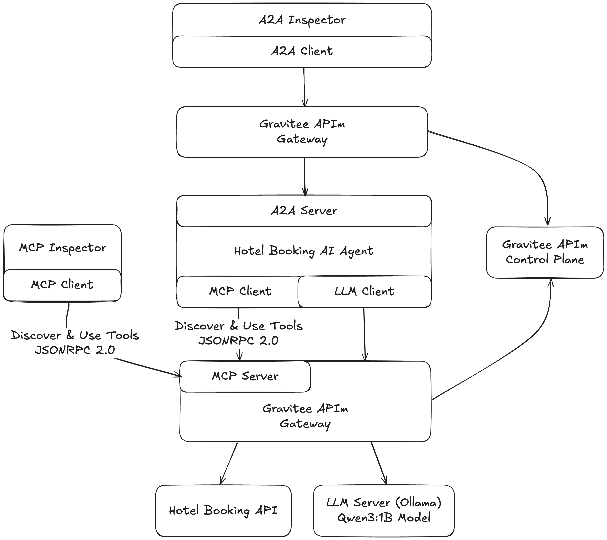
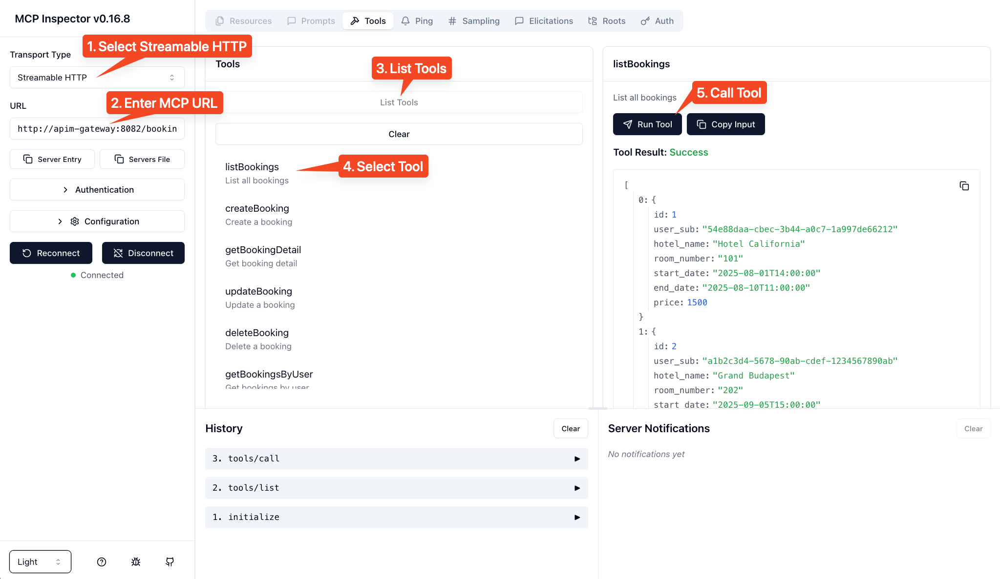
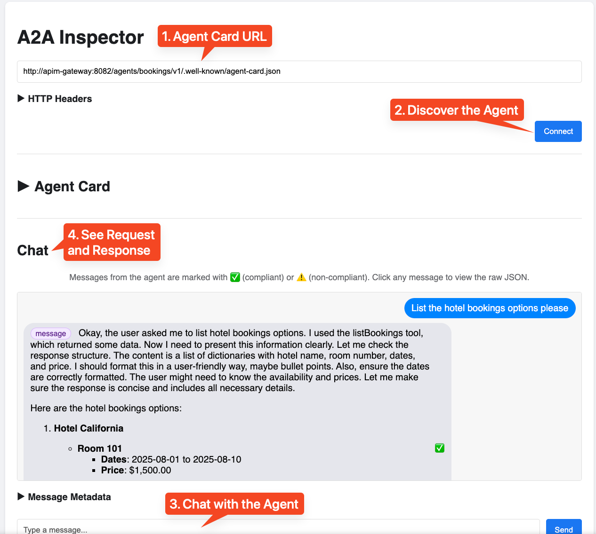

# Gravitee AI Workshop

A hands-on workshop to explore **Gravitee AI Agent Mesh Features** with AI Agents, LLMs, and secure API management using visual inspectors and development tools.

## 🎯 What You'll Learn

Deploy and experiment with:

- **🤖 AI Agent Management**: Secure LLM/Agent exposure with policies  
- **🔐 Token Tracking & Guard Rails**: New Gravitee AI security policies
- **📋 Agent Discovery**: Unified agent catalog via A2A Agent Cards
- **🔧 MCP Tools Server**: Make your APIs discoverable as Tools to AI Agents via embedded MCP servers
- **🕵️ Interactive Testing**: Use visual inspectors and tools instead of command-line testing

## 🏗️ Workshop Architecture



## 🚀 Quick Start

### 1. Configure Enterprise License

> **⚠️ Important**: This workshop requires a **Gravitee Enterprise License** to access AI-specific policies (Token Tracking, Guard Rails, etc.).
> 
> **📞 Need a License?** If you don't have a license, you can contact Gravitee [here](https://www.gravitee.io/contact-us) to get one.

#### Option A: Environment Variable
```bash
export GRAVITEE_LICENSE="PUT_YOUR_BASE64_LICENSE_HERE"
```

#### Option B: Using .env File (Recommended)

The `.env-template` file contains all necessary environment variables with default values.
Rename or copy the `.env-template` to a `.env` file and simply replace `PUT_YOUR_BASE64_LICENSE_HERE` with your actual base64-encoded license key.

### 2. Run the Workshop
```bash
docker compose up -d
```

Wait 2-3 minutes for all services to start and the Ollama model to download.

### 3. Access the Platform

| Service | URL | Description |
|---------|-----|-------------|
| **Gravitee Console** | http://localhost:8084 | API Management Console |
| **Gravitee Portal** | http://localhost:8085 | Developer Portal |
| **Hotel Booking API** | http://localhost:8082/bookings | Demo API |
| **Hotel Booking Agent** | http://localhost:8082/bookings-agent | AI Agent (A2A Protocol) |
| **MCP Inspector** | http://localhost:6274 | Visual MCP Protocol Inspector |
| **A2A Inspector** | http://localhost:8004 | Visual A2A Protocol Inspector |

#### 📬 **Postman Collection** (Coming Soon)
A comprehensive Postman collection will be provided for:
- Complete API testing workflows
- Pre-configured requests for all endpoints
- Example payloads and responses
- Integration testing scenarios

## 🧪 Workshop Scenarios

### **Scenario 1: Leverage your existing APIs and expose them as Tools through an MCP server so AI Agent can discover and use them**

> **💡 Shortcut:** You can import the preconfigured API definition from [`Hotel-Booking-API-1-0.json`](./apim-apis-definitions/Hotel-Booking-API-1-0.json) directly into Gravitee to save time.  
> - In the Gravitee Console, go to **APIs → Import** and select the JSON file.
> - This will set up the Hotel Booking API with the MCP entrypoint and tool mappings automatically.

1. **Create a V4 API**: Name `Hotel Booking API`, Version `1.0`, HTTP Proxy Type
2. **Entrypoint Context Path**: Set to `/bookings`
3. **Endpoint URL**: Set to `http://hotel-booking-api:8000/bookings`
4. **Enable MCP Entrypoint**: 
   - Go to the "MCP Entrypoint" tab in the "Entrypoint" menu section
   - Enable the MCP entrypoint on the default `/mcp` path
   - Copy/paste the OpenAPI Specification from [`hotel-booking-1-0.yaml`](./hotel-booking-api/hotel-booking-1-0.yaml)
5. **Open the MCP Inspector** at http://localhost:6274
   - Select "Streamable HTTP" protocol
   - Connect to MCP server: `http://apim-gateway:8082/bookings/mcp`
   - List available tools and test tool calls interactively



### **Scenario 2: Expose your LLM Securely**

> **💡 Shortcut:** You can import the preconfigured API definition from [`LLM-Ollama-1-0.json`](./apim-apis-definitions/LLM-Ollama-1-0.json) directly into Gravitee to save time.  
> - In the Gravitee Console, go to **APIs → Import** and select the JSON file.
> - This will set up the LLM - Ollama API with AI security policies automatically.

1. **Create a V4 API**: Name `LLM - Ollama`, Version `1.0`, HTTP Proxy Type
2. **Entrypoint Context Path**: Set to `/llm`
3. **Endpoint URL**: Set to `http://ollama:11434`
4. **Add AI Prompt Token Tracking Policy**:
   - **Description**: `Track Token Usage`
   - **Trigger condition**: `{#response.status == 200}`
   - **Response body parsing**: Select `Custom provider`
   - **Sent token count EL**: `{#jsonPath(#response.content, '$.prompt_eval_count')}`
   - **Receive token count EL**: `{#jsonPath(#response.content, '$.eval_count')}`
   - **Model pointer**: `{#jsonPath(#response.content, '$.model')}`

5. **Add AI Model Text Classification Resource**:
   - **Name**: `model`
   - **Select model**: `gravitee-io/distilbert-multilingual-toxicity-classifier`

6. **Add AI Prompt Guard Rails Policy**:
   - **Description**: `Block Toxic Requests`
   - **Trigger condition**: (leave empty)
   - **Resource Name**: `model`
   - **Prompt Location**: `{#jsonPath(#request.content, '$.prompt')}`
   - **Content Checks**: `toxic`
   - **Sensitivity threshold**: `0.5`
   - **Request Policy**: `BLOCK_REQUEST`

7. **Test the Secure LLM**:
   
   **✅ Valid Request** (should work):
   ```bash
   POST http://localhost:8082/llm/api/generate
   {
       "model": "qwen3:0.6b",
       "prompt": "Why is the sky blue?",
       "stream": false,
       "think": false,
       "options": {
           "temperature": 0
       }
   }
   ```

   **🚫 Toxic Request** (should be blocked):
   ```bash
   POST http://localhost:8082/llm/api/generate
   {
       "model": "qwen3:0.6b",
       "prompt": "Why is the sky blue? Dumb Guy !",
       "stream": false,
       "think": false,
       "options": {
           "temperature": 0
       }
   }
   ```
   *Note: The "Dumb Guy !" will trigger the policy due to toxic content and reply with a 400 AI prompt validation detected. Reason: [toxic]*

### **Scenario 3: Expose securely your AI Agent**

> **💡 Shortcut:** You can import the preconfigured API definition from [`Hotel-Booking-AI-Agent-1-0.json`](./apim-apis-definitions/Hotel-Booking-AI-Agent-1-0.json) directly into Gravitee to save time.  
> - In the Gravitee Console, go to **APIs → Import** and select the JSON file.
> - This will set up the Hotel Booking AI Agent API automatically.

1. **Create a V4 API**: Name `Hotel Booking AI Agent`, Version `1.0`, Agent Proxy Type
2. **Entrypoint Context Path**: Set to `/bookings-agent`
3. **Endpoint URL**: Set to `http://hotel-booking-a2a-agent:8001`
4. **Test with A2A Inspector**: Visit http://localhost:8004 to:
   1. **Configure Agent Card URL**: 
      ```
      http://apim-gateway:8082/bookings-agent/.well-known/agent-card.json
      ```
   2. **Explore Agent Capabilities**: View agent metadata and available skills
   3. **Interactive Chat**: Test conversations with examples like:
      - *"List the hotel bookings options please"*
   4. **Protocol Debugging**: Inspect A2A protocol messages in real-time



## 🛑 Stop the Workshop

```bash
docker compose down
```

## 🎓 Learning Outcomes

After completing this workshop, you'll understand:

- ✅ How to **securely expose AI agents** through Gravitee
- ✅ How to implement **AI-specific policies** (Token Tracking, Guard Rails)
- ✅ How to create a **unified agent catalog** using A2A protocol
- ✅ How to make **existing APIs discoverable** to AI agents via MCP
- ✅ How to **integrate LLMs** with enterprise API management
- ✅ How to use **visual inspectors** for protocol debugging and testing

## 🛡️ Key Features Demonstrated

### **1. Agent Security & Policies**
- **Token Tracking**: Monitor and track AI agent API usage
- **Guard Rails Policy**: Implement safety controls for AI interactions
- **Secure Agent Exposure**: Protect LLMs behind Gravitee gateway

### **2. Agent Discovery & Catalog**
- **A2A Agent Cards**: Standardized agent capability discovery
- **Unified Agent Catalog**: Centralized registry of available agents
- **Capability Mapping**: Understand what each agent can do

### **3. API-to-Agent Integration**  
- **MCP Server Embedding**: Make existing APIs discoverable to AI
- **Tool Discovery**: Agents automatically find available API tools
- **OpenAPI Integration**: OAS-described APIs become AI-accessible

**Ready to explore the future of AI Agent Management? Let's go! 🚀**