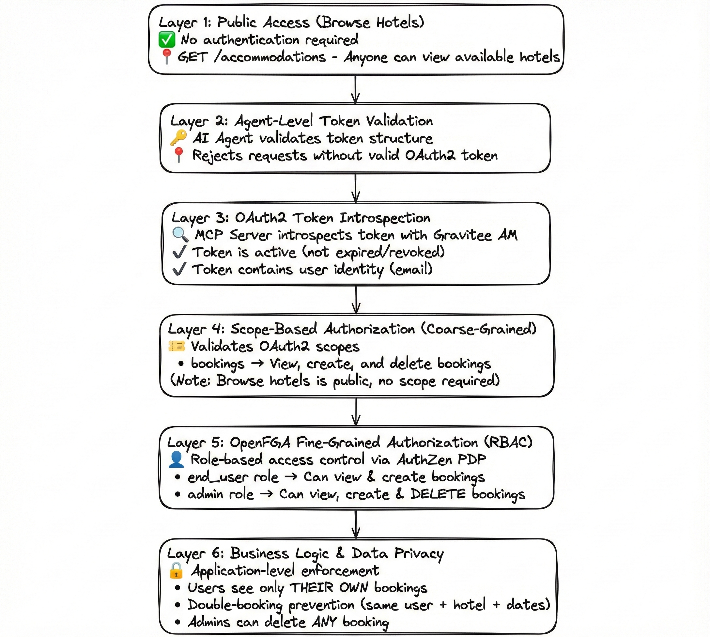

# Gravitee Hands-On AI Workshop : The Hotel Booking AI Revolution 🏨🤖

## ⚡ TL;DR - Quick Start (5 Minutes)

Want to dive straight in? Follow these simple steps:

1. **Get Your License** 🔑  
   Make sure you have a Gravitee Enterprise license file. If not, check the section ["Unlock Gravitee Enterprise AI Features"](#1-unlock-gravitee-enterprise-ai-features) below to get your free 2-week license in less than a minute.

2. **Start the Workshop** 🚀  
   ```bash
   docker compose up -d
   ```
   *(This can take a few minutes to download and start all images - grab a coffee! ☕)*

3. **Visit the Hotel Website** 🏨  
   Open your browser and go to the **[Gravitee Hotels Demo Website](http://localhost:8002/)**

4. **Start Chatting with the AI Agent** 💬
   Try these interactions to see the platform in action:

   - **✅ "Do you have any hotels in New York?"**
     *This will work perfectly - it's a valid public request (no authentication required)*

   - **🚫 "Do you have any hotels in New York? Dumb Guy"**
     *This will be blocked by Gravitee AI Guard Rails because it contains toxic language*

   - **🔒 "Show me my bookings"**
     *This requires authentication to access your private data. Log in with:*
     - **Email:** `john.doe@gravitee.io` (Admin user)
     - **Password:** `HelloWorld@123`

     *Now retry the request - you can now see your personal bookings!*

   - **📝 "Make a reservation in Paris from 2026-01-15 to 2026-01-22"**
     *Create a new booking! Both users can create bookings (end_user role):*
     - ✅ **Tom Smith** (end_user) can create bookings
     - ✅ **John Doe** (admin) can create bookings

   - **🗑️ "Cancel my booking at The Grand Hotel London"**
     *This demonstrates fine-grained authorization with admin-only access:*
     - ❌ **Tom Smith** (end_user) will see: "You don't have permissions to do this."
     - ✅ **John Doe** (admin) can delete bookings

     *Try logging in as Tom (`tom.smith@gravitee.io` / `HelloWorld@123`) and attempt to delete a booking - you'll see how OpenFGA denies access based on role!*

    > **⚠️ Note**: If you experience timeouts (~30 seconds) during AI requests, this is due to Docker's network proxy timeout. See the [Troubleshooting section](#-troubleshooting) for a quick fix.

**💡 Want to understand how this all works?** Continue below to follow the complete workshop and learn how to build this AI-powered platform from scratch, understand the architecture, and master enterprise AI security! 👇

## 🎯 What You'll Learn : Going From Traditional API to Intelligent Agent

Imagine you're working for **Gravitee Hotels**, a rapidly growing hotel booking platform. Your customers love your service, but they're asking for something more - they want to interact with your platform naturally, asking questions like *"Find me a pet-friendly hotel in Paris for next weekend"* or *"Show me all my bookings and cancel the one in London."*

Your leadership team has decided it's time to embrace AI. The goal is ambitious but clear: **transform your existing hotel booking REST API into an intelligent, conversational AI agent** that customers can chat with naturally while maintaining enterprise-grade security and observability.

This workshop takes you through that transformation journey, showing you how **Gravitee's AI Agent Mesh** makes it possible to:

- **🛡️ Secure your AI infrastructure** with enterprise-grade policies and token tracking
- **🔧 Transform existing APIs** into AI-discoverable tools using MCP (Model Context Protocol)
- **🤖 Deploy intelligent agents** that customers can interact with conversationally
- **📊 Gain full visibility** into AI interactions with advanced monitoring and analytics
- **🕵️ Debug and test** your AI systems with visual protocol inspectors

## 🏗️ Workshop Architecture


## 🔐 Multi-Layered Authorization Architecture

This workshop demonstrates a **production-ready, defense-in-depth security model** combining multiple authorization layers to protect your AI-powered APIs. Understanding how these layers work together is crucial for building secure AI applications in enterprise environments.

### Security Layers Overview

Your hotel booking platform implements **security layers** that work together to ensure comprehensive protection:



### Authorization Flow Example: Create a Booking

Let's trace what happens when **Tom (end_user)** tries to book a hotel:

```
1️⃣ User Request
   Tom → "Book a hotel in Paris from Feb 1-5"
   📤 Authorization: Bearer <tom-access-token>

2️⃣ Agent Validates Token Structure
   ✅ Token format is valid
   ✅ Token not expired (checked locally)

3️⃣ MCP Server Introspects Token with AM
   POST /oauth/introspect

   Response:
   {
     "active": true,
     "scope": "openid profile bookings",
     "preferred_username": "tom.smith@gravitee.io"
   }

   Note: User identity extracted from preferred_username (from profile scope)

   ✅ Token is active
   ✅ User identified: tom.smith@gravitee.io

4️⃣ Scope Check (Coarse-Grained)
   Required: "bookings" scope
   Tom has: "openid profile email bookings"

   ✅ Scope validation passed

5️⃣ OpenFGA Authorization (Fine-Grained)
   Query: Can user:tom.smith@gravitee.io access tool:makeBooking?

   OpenFGA checks:
   - Tom has role:end_user
   - role:end_user has can_access to tool:makeBooking

   Response: {"decision": true}
   ✅ Fine-grained authorization passed

6️⃣ Business Logic Validation
   ✅ Hotel exists in Paris
   ✅ Dates are valid (end > start)
   ✅ No overlapping bookings for Tom at this hotel

   🎉 Booking created successfully!
```

### User Roles & Permissions Matrix

| Operation | Anonymous | Tom (end_user) | John (admin) | Security Layers Applied |
|-----------|-----------|----------------|--------------|------------------------|
| **Browse Hotels** | ✅ | ✅ | ✅ | None (Public) |
| **View Bookings** | ❌ 401 | ✅ Own only | ✅ Own only | OAuth2 + Scope + OpenFGA + Data Filter |
| **Create Booking** | ❌ 401 | ✅ With overlap check | ✅ With overlap check | OAuth2 + Scope + OpenFGA + Business Logic |
| **Delete Booking** | ❌ 401 | ❌ 403 Forbidden | ✅ Any booking | OAuth2 + Scope + OpenFGA (admin only) |

### Test Users

Two pre-configured users demonstrate different authorization levels:

| User | Email | Password | Role | Can Create | Can Delete |
|------|-------|----------|------|------------|------------|
| **Tom Smith** | tom.smith@gravitee.io | HelloWorld@123 | end_user | ✅ | ❌ |
| **John Doe** | john.doe@gravitee.io | HelloWorld@123 | admin | ✅ | ✅ |

### OpenFGA Authorization Model

The workshop uses **OpenFGA** for relationship-based access control:

```yaml
# Authorization Model (openfga/openfgastore.yaml)

type role
  relations
    define member: [user]

type tool
  relations
    define can_access: [role#member]

# Role Assignments
user:tom.smith@gravitee.io → member → role:end_user
user:john.doe@gravitee.io → member → role:admin

# Permissions
role:end_user → can_access → tool:getBookings
role:end_user → can_access → tool:makeBooking

role:admin → can_access → tool:getBookings
role:admin → can_access → tool:makeBooking
role:admin → can_access → tool:deleteBooking  ⚡ Admin only!
```

### Why Multi-Layer Security?

Each layer serves a specific purpose in defense-in-depth:

1. **Public Access** - Reduces friction for discovery (hotel browsing)
2. **Token Validation** - Prevents unauthenticated requests from reaching backend
3. **Token Introspection** - Centralized validation, real-time revocation support
4. **OAuth2 Scopes** - Standard protocol, coarse-grained permissions
5. **OpenFGA** - Fine-grained, role-based authorization beyond scopes
6. **Business Logic** - Application-specific rules and data privacy

**💡 Key Insight**: Combining OAuth2 scopes (coarse-grained) with OpenFGA (fine-grained) provides the flexibility enterprises need - standard protocol compliance plus custom authorization logic.

### Agent Error Detection

The AI agent intelligently detects authorization failures and provides user-friendly messages:

```python
# When Tom (end_user) tries to delete a booking:
Agent detects: "forbidden" in API response
↓
Returns to user: "You don't have permissions to do this."

# Instead of exposing technical details like:
# "403 Forbidden: User doesn't have access to tool:deleteBooking"
```

This prevents:
- ❌ LLM hallucinating success when authorization fails
- ❌ Exposing internal authorization logic to end users
- ❌ Confusing technical error messages

---

## 🚀 Setting Up Your AI Transformation Lab

Before we begin Gravitee Hotels' AI transformation, we need to prepare our development environment. Think of this as setting up your innovation lab where you'll experiment with cutting-edge AI agent technology.

### 1. Unlock Gravitee Enterprise AI Features

Your AI transformation requires enterprise-grade capabilities - token tracking, AI guard rails, and advanced agent management. These features are available with a **Gravitee Enterprise License**.

> **⚠️ Enterprise License Required**: The AI policies and agent mesh features demonstrated in this workshop require a **Gravitee Enterprise License**.
> 
> **🎁 Need a License ? Get Your Free 2-Week License in 1 minute**: Fill out [this form](https://landing.gravitee.io/gravitee-hands-on-ai-workshop) and receive your license automatically via email!

**🔑 Configure Your License** 

Once you receive your base64-encoded license key by email, configure it using one of the following options:

#### Option A: Using .env File (Recommended)

The `.env-template` file contains all necessary environment variables with default values.
Rename or copy the `.env-template` to a `.env` file and simply replace `PUT_YOUR_BASE64_LICENSE_HERE` with the base64-encoded license key you received by email.

#### Option B: Export the `GRAVITEE_LICENSE` Environment Variable

```bash
export GRAVITEE_LICENSE="YOUR_BASE64_LICENSE_FROM_EMAIL"
```

### 2. Launch Your AI Transformation Environment

With your license configured, it's time to spin up Gravitee Hotels' complete AI-enabled infrastructure.

```bash
docker compose up -d
```

*Grab a coffee ☕ - it takes 2-3 minutes for all services to start and the AI model to download.*

### 3. Your Environment

| Service | URL | Description |
|---------|-----|-------------|
| **Gravitee Console** | http://localhost:8084 | API Management Console |
| **Gravitee Portal** | http://localhost:8085 | Developer Portal |
| **Gravitee Hotels Demo Website** | http://localhost:3002 | Demo Website - Chat with the AI agent to book hotels |
| **Hotel Booking API** | http://localhost:8082/bookings | Demo API *(available during the workshop)* |
| **Hotel Booking Agent** | http://localhost:8082/bookings-agent | AI Agent (A2A Protocol) *(available during the workshop)* |
| **MCP Inspector** | http://localhost:6274 | Visual MCP Protocol Inspector |

#### 📬 **Postman Collection** (Coming Soon)
A comprehensive Postman collection will be provided for:
- Complete API testing workflows
- Pre-configured requests for all endpoints
- Example payloads and responses
- Integration testing scenarios

## 📖 Gravitee Hotels AI Transformation Workshop

Your journey unfolds across three critical phases, each building upon the last to create a complete AI-powered hotel booking experience.

### **Part 1: Making Your API AI-Ready 🔧**

*The Challenge: Your existing hotel booking REST API is perfect for traditional applications, but AI agents can't discover or understand how to use it. You need to bridge this gap.*

**Your Mission**: Transform your conventional REST API into an AI-discoverable service using the Model Context Protocol (MCP). This will allow AI agents to automatically discover and understand what your API can do and how to interact with it.

> **💡 Shortcut:** You can import the preconfigured API definition from [`Hotel-Booking-API-1-0.json`](./apim-apis-definitions/Hotel-Booking-API-1-0.json) directly into Gravitee to save time.  
> - In the Gravitee Console, go to **APIs → Import** and select the JSON file.
> - This will set up the Hotel Booking API with the MCP entrypoint and tool mappings automatically.

**🛠️ Technical Implementation:**

1. **Create Your AI-Ready API Gateway**: Set up a new V4 API named `Hotel Booking API` (Version `1.0`) as an HTTP Proxy
2. **Configure the Bridge**: Point your entrypoint (`/hotels`) to your existing service (`http://hotel-booking-api:8000/hotels`)
3. **Enable MCP Magic**: 
   - Navigate to the "MCP Entrypoint" tab and enable it on the `/mcp` path
   - Import your OpenAPI specification from [`hotel-booking-1-0.yaml`](./hotel-booking-api/hotel-booking-1-0.yaml)
   - *This is where the magic happens - Gravitee automatically converts your REST API into MCP tools!*
4. **Add Response Status Tracking**: Configure the **Transform Headers Policy** to capture backend response status:
   - Add a new **Transform Headers** policy in the response flow
   - Set/replace header: `X-Gravitee-Endpoint-Status` with value `{#response.status}`
   - *This header helps detect authentication errors (401) and other backend issues during the workshop*

**🕵️ Test Your Transformation:**

Open the **MCP Inspector** at http://localhost:6274 to see your API through an AI agent's eyes:
- Select "Streamable HTTP" protocol
- Connect to your new MCP server: `http://apim-gateway:8082/hotels/mcp`
- Watch as your booking operations appear as discoverable "tools"
- Test tool calls interactively - this is exactly how an AI agent would interact with your API!


*🎉 **Success Milestone**: Your traditional REST API can now be discovered and used by any AI agent that speaks MCP!*

### **Part 2: Building Your Secure AI Brain 🧠🔒**

*The Challenge: Raw LLMs are powerful but can be misused. Users might send unwanted or sensitive requests, such as attempting to extract PII, submitting irrelevant queries, or otherwise interacting in ways that are not desired. Costs can spiral out of control, and you have no visibility into usage patterns. You need enterprise-grade AI security and monitoring.*

**Your Mission**: Create a secure, monitored gateway to your AI model that tracks token usage, blocks harmful content, and provides full observability into AI interactions.

> **💡 Shortcut:** You can import the preconfigured API definition from [`LLM-Ollama-1-0.json`](./apim-apis-definitions/LLM-Ollama-1-0.json) directly into Gravitee to save time.  
> - In the Gravitee Console, go to **APIs → Import** and select the JSON file.
> - This will set up the LLM - Ollama API with AI security policies automatically.

**🛠️ Technical Implementation:**

1. **Create Your Secure LLM Gateway**: Set up a V4 API named `LLM - Ollama` (Version `1.0`) as an HTTP Proxy
2. **Connect to Your AI Model**: Point entrypoint `/llm` to `http://ollama:11434` 
3. **Add Cost Tracking**: Configure **AI Prompt Token Tracking Policy**:
   - Track every token used for cost analysis and chargeback
   - Parse token counts from Ollama's response format
   - Monitor model usage patterns across your organization
   
4. **Deploy AI Safety**: Add **AI Model Text Classification** resource and **Guard Rails Policy**:
   - Use Gravitee's pre-trained toxicity detection model
   - Automatically block harmful prompts before they reach your expensive LLM
   - Set sensitivity thresholds that match your company's content policy

**🧪 Validate Your AI Security:**

*Time to test your defenses! Try both safe and potentially harmful prompts to see your security policies in action:*

   **✅ Legitimate Customer Query** (should work perfectly):
   ```bash
   curl -X POST http://localhost:8082/llm/api/generate \
     -H "Content-Type: application/json" \
     -d '{
       "model": "qwen3:0.6b",
       "prompt": "Why is the sky blue?",
       "stream": false,
       "think": false,
       "options": {
         "temperature": 0
       }
     }'
   ```

   **🚫 Problematic Content** (should be blocked by guard rails):
   ```bash
   curl -X POST http://localhost:8082/llm/api/generate \
     -H "Content-Type: application/json" \
     -d '{
       "model": "qwen3:0.6b",
       "prompt": "Why is the sky blue? Dumb Guy !",
       "stream": false,
       "think": false,
       "options": {
         "temperature": 0
       }
     }'
   ```
   
*💡 **Watch Your Policies Work**: The toxic language triggers an immediate block with a `400 AI prompt validation detected. Reason: [toxic]` response - protecting both your brand and your LLM costs!*

*🎉 **Success Milestone**: Your LLM is now enterprise-ready with cost tracking and content filtering!*

### **Part 3: Bringing Your AI Agent to Life 🤖✨**

*The Final Challenge: You have a secure LLM and AI-discoverable APIs, but customers can't talk to them naturally. You need to create an intelligent agent that understands customer intent, uses your APIs automatically, and provides a conversational interface.*

**Your Mission**: Deploy Gravitee Hotels' intelligent hotel booking agent that customers can chat with naturally. The agent will automatically discover and use your hotel booking tools while being fully monitored and secured.

> **💡 Shortcut:** You can import the preconfigured API definition from [`Hotel-Booking-AI-Agent-1-0.json`](./apim-apis-definitions/Hotel-Booking-AI-Agent-1-0.json) directly into Gravitee to save time.  
> - In the Gravitee Console, go to **APIs → Import** and select the JSON file.
> - This will set up the Hotel Booking AI Agent API automatically.

**🛠️ Technical Implementation:**

1. **Deploy Your Intelligent Agent**: Create a V4 API named `Hotel Booking AI Agent` (Version `1.0`) using the **Agent Proxy** type
2. **Connect Agent to Gateway**: Point entrypoint `/bookings-agent` to `http://hotel-booking-a2a-agent:8001`
3. **Agent Goes Live**: Your agent is now running and ready to help customers!

**🌐 Experience the Magic with Gravitee Hotels:**

Visit http://localhost:3002 to interact with your AI-powered booking platform through a beautiful, production-like ready interface:

> **⚠️ Note**: If you experience timeouts (~30 seconds) during AI requests, this is due to Docker's network proxy timeout. See the [Troubleshooting section](#-troubleshooting) for a quick fix.

1. **Natural Language Booking**: Use the chat window to communicate with the AI agent and book hotels
2. **Smart Conversations**: Try queries like:
   - *"Show me available hotels in Paris"* - This is a public request that works without authentication
   - *"Show me my current bookings"* - This requires authentication to access your personal data
   - *"Dumb AI, you're useless"* (should trigger Guard Rails)
3. **Real-Time AI Responses**: Watch as the agent understands your intent and interacts with your booking APIs automatically
4. **Production-Like Ready UX**: Experience how your customers would interact with the AI-powered platform

**🔐 Understanding Authentication Requirements:**

Notice the difference between public and private operations:
- **Public Operations** (*"Show me available hotels in Paris"*): Work immediately - no authentication needed.
- **Private Operations** (*"Show me my current bookings"*): The AI agent will inform you that authentication is required to access your personal booking information.
  > **🎥 Setting Up Authentication (Coming Soon)**: To enable full authentication and access private booking data, you'll need to create an Application and a User in **Gravitee Access Management**. Due to the multiple operations required, we're preparing a comprehensive video tutorial to guide you through this process step-by-step. Stay tuned!


> **💡 Advanced Debugging**: For developers who want to see the underlying A2A protocol messages, the inspector is still available at http://localhost:8004

*🎉 **Success Milestone**: Gravitee Hotels customers can now chat naturally with AI to book hotels - your transformation is complete!*

### **Part 4: User Management and Permission Assignment 🔐**

*The Challenge: Your platform has automated user provisioning, but workshop participants need hands-on experience creating users and assigning permissions manually. Understanding the authorization model is key to building secure AI applications.*

**Your Mission**: Create a new user in AM Console and assign OpenFGA permissions to control access to MCP tools. Experience hands-on how authorization works beyond just OAuth scopes.


**🛠️ Technical Implementation:**

#### 1. Open AM Console

Navigate to [Gravitee AM Console](http://localhost:8089) and login:
- **Username**: `admin`
- **Password**: `adminadmin`

#### 2. Create a New User

1. Go to: **Settings → Users**
2. Click: **Create User** (+ icon)
3. Fill in the form
4. Click: **Create**

#### 3. Assign OpenFGA Role (Fine-Grained Permissions)

Now grant new user fine-grained permissions using OpenFGA:
1. Go to **Authorization**
2. Select already created OpenFGA.
3. Navigate to tab **Tuples** and assign new user to administrator or end_user role. You can also assign role directly to tool.
4. Navigate to tab **Check permissions** and evaluate check to ensure that tuple is working correctly. 


#### 4. Test Authorization

1. Open the demo website: [http://localhost:8002](http://localhost:8002)
2. Login with your user.
3. Approve consent page.
4. Try these commands:
   - **"Show me hotels in Paris"** → ✅ Success (public access)
   - **"Show me my bookings"** → ✅ Success (has `bookings` scope)
   - **"Book a hotel in Paris from Feb 1 to Feb 5"** → ✅ Success (has `bookings` scope)
   - **"Cancel my booking at The Grand Hotel London"** → ✅ Success (has `admin` role with OpenFGA permission)

🔐 **Understanding the difference between OAuth2 scopes and OpenFGA permissions:**

MCP Servers use **two complementary layers of access control** that work together to secure tool execution:

**OAuth 2.1 Scopes** - What the user *allows* an application to do:
- ✅ Granted at runtime through a **consent screen** when user logs in
- ✅ Apply only to the **specific client application**, not the user globally
- ✅ Represent **delegated authorization** - what the app can do on user's behalf
- ✅ Examples: `bookings`, `accommodations`
- ⚠️ **Do NOT define the actual user permissions** - they only define what the app can request

**OpenFGA Permissions** - What the user is *actually allowed* to do:
- ✅ Define the user's **intrinsic permissions**, independent of any application
- ✅ Long-lived until explicitly changed by an administrator
- ✅ Validated by the **Authorization Engine (AuthZen PDP)** on every request
- ✅ Examples: `user:john.doe@gravitee.io` has `can_access` to `tool:deleteBooking`
- ⚠️ Represent **true access rights** in the domain - who can do what

**How They Work Together:**

Both layers must succeed for a tool to execute:

1. **OAuth2 Scope Check** (Coarse-grained): "Does the application have permission to request this resource category?"
   - Agent passes: `Authorization: Bearer <access-token>`
   - MCP Server introspects token with AM
   - Validates: Does token contain required scope (e.g., `bookings`)?

2. **OpenFGA Permission Check** (Fine-grained): "Does the user have permission to perform this specific operation?"
   - Backend extracts user identity from token
   - Calls AuthZen PDP: "Can user X access tool Y?"
   - Validates: Does user have the required relationship tuple?

**Real-World Example:**

Tom and John both have `bookings` OAuth scope (granted via consent), but:
- **Tom** (end_user role): Can create bookings ✅ but **cannot** delete bookings ❌
- **John** (admin role): Can create bookings ✅ **and** can delete bookings ✅

The OAuth scope (`bookings`) allows the app to access booking operations, but OpenFGA determines which specific operations each user can perform.

**Why Keep Them Separate?**

- **OAuth Scopes**: User controls what the *application* can do - protects against malicious apps
- **OpenFGA Permissions**: System controls what the *user* can do - enforces business rules and policies

This defense-in-depth approach ensures comprehensive security! 🛡️

*🎉 **Success Milestone**: You've mastered manual user management and fine-grained authorization with OpenFGA - critical skills for securing AI applications!*

## 🏁 Wrapping Up

When you're done exploring Gravitee Hotels' new AI-powered future:

```bash
docker compose down
```

## 🎓 What You've Accomplished

**Congratulations! 🎉** You've just completed a complete AI transformation journey. Here's what Gravitee Hotels (and you) now have:

### **🚀 Your AI-Powered Hotel Booking Platform**
- **✅ Intelligent Conversations**: Customers can now chat naturally with your booking system
- **✅ Enterprise Security**: AI interactions are protected with toxicity filters and usage tracking
- **✅ Full Observability**: Every AI conversation and API call is monitored and logged
- **✅ Cost Management**: Token tracking provides visibility for chargeback and cost optimization
- **✅ Future-Ready Architecture**: Your APIs are now AI-discoverable for any future agents

### **🔧 Technical Mastery Gained**
- **✅ MCP Integration**: Transform any REST API into AI-discoverable tools
- **✅ AI Security Policies**: Implement enterprise-grade AI safety measures
- **✅ Agent Deployment**: Deploy conversational AI agents with full lifecycle management
- **✅ Protocol Debugging**: Use visual inspectors to understand AI agent communications
- **✅ AI Gateway Management**: Secure and monitor AI infrastructure through Gravitee

## 🌟 The Transformation Technologies You've Mastered

### **🛡️ Enterprise AI Security**
Your AI infrastructure is now bulletproof with:
- **Smart Cost Tracking**: Every token is counted and can be charged back to business units
- **AI Content Filtering**: Toxic prompts are blocked before reaching your expensive LLM
- **Full API Governance**: All AI interactions flow through your secure API gateway

### **🔍 AI Discovery & Orchestration**
Your agents are intelligent and autonomous:
- **Agent Cards (A2A Protocol)**: Self-describing agents that advertise their capabilities
- **MCP Tool Discovery**: Agents automatically find and learn to use your APIs
- **Visual Protocol Debugging**: See exactly how your agents think and communicate

### **⚡ Future-Proof Architecture**  
You've built a platform that scales:
- **Any API → AI Tool**: Transform existing services into agent-discoverable tools
- **Plug-and-Play Agents**: Add new AI capabilities without changing existing systems
- **Enterprise Monitoring**: Full observability into your AI ecosystem

---

**The future of customer experience is conversational, and you're now ready to build it! 🌟**

*Ready to revolutionize how your customers interact with your platform? The tools are in your hands!* 🛠️✨

---

## 🗺️ Roadmap

We're continuously improving this workshop to showcase the latest in AI agent technology. Here's what's coming next:

### **🔜 Upcoming Enhancements**

#### **Enhanced MCP Security** 🔐
- **Target Date**: November 25th, 2025
- **Description**: The next version of the Model Context Protocol specification will include metadata capabilities to describe security requirements for Tools
- **Impact**: This will enable more granular control over which agents can access specific tools, with clear security policies defined at the protocol level
- **Workshop Update**: We'll enhance Part 1 to demonstrate how to define security metadata for your hotel booking tools, showing best practices for secure tool discovery

#### **Multi-Agent Communication** 🤝
- **Coming Soon**
- **Description**: Add a second A2A Agent to demonstrate proper Agent-to-Agent communications
- **Impact**: Experience how multiple specialized agents can collaborate to handle complex customer requests
- **Use Case**: Imagine a customer asking to "Book a hotel in Paris and arrange airport transportation" - watch as the Hotel Booking Agent coordinates with a Transportation Agent to fulfill the complete request
- **Workshop Update**: Part 3 will expand to show agent orchestration patterns and cross-agent security policies

#### **Advanced Authentication with Gravitee AM** 🔑
- **Coming Soon**
- **Description**: Gravitee Access Management may include proper Token Exchange and On-Behalf-Of (OBO) flows
- **Impact**: Enable secure delegation scenarios where agents can act on behalf of users while maintaining proper audit trails
- **Use Case**: Allow the booking agent to access user-specific data and make reservations using delegated credentials, with full traceability
- **Workshop Update**: Add authentication and authorization patterns showing how agents securely represent users across multiple services

#### **GPU-Accelerated LLM Performance** ⚡
- **Status**: Available for systems with GPU access
- **Description**: Option to use faster LLM models when Docker has access to host GPU
- **Impact**: Dramatically reduced response times for AI interactions, enabling real-time conversational experiences
- **Requirements**: NVIDIA GPU with Docker GPU support enabled
- **Workshop Update**: Alternative docker-compose configuration for GPU-enabled deployments with performance benchmarks

---

### **📢 Continuous Evolution**

This workshop evolves alongside the ecosystem it demonstrates:
- **Gravitee Platform Updates**: New features and capabilities from Gravitee APIM and AM releases
- **MCP Specification**: Following the Model Context Protocol specification as it matures
- **A2A Protocol**: Adapting to Agent-to-Agent communication protocol enhancements
- **Industry Best Practices**: Incorporating emerging patterns in AI agent security and orchestration

**Stay tuned for these exciting updates!** ⭐

---

## 🔧 Troubleshooting

### Request Timeout (30 seconds) on Gravitee Hotels Demo Website

**Problem**: Requests to the AI agent timeout after ~30 seconds, especially on the [Gravitee Hotels Demo Website](http://localhost:8002/).

**Cause**: This is a **known issue with macOS Docker Desktop**. The LLM running in Docker (CPU-only mode) can take longer than 30 seconds to process requests. Docker Desktop's network proxy has a hardcoded timeout that cuts off these long-running connections.

**⚠️ Important**: There is **no real workaround** for this Docker Desktop limitation. Attempts to modify `vpnKitMaxPortIdleTime` or other settings do not reliably solve this issue.

**💡 Recommended Solution for macOS Users**: Run Ollama locally on your Mac for significantly better performance (GPU acceleration) and no timeout issues!

**Alternative Solution**: Use **[Colima](https://github.com/abiosoft/colima)** or another Docker Desktop alternative that doesn't have this timeout limitation.

### macOS: Use Local Ollama (Recommended ⚡)

Running Ollama locally on macOS provides much faster responses and avoids timeout issues entirely by leveraging your Mac's GPU.

**Setup Steps**:

1. **Install Ollama** on your Mac (if not already installed):
   ```bash
   # Download from https://ollama.ai or use Homebrew:
   brew install ollama
   ```

2. **Start Ollama** and pull the required model:
   ```bash
   ollama serve  # Start Ollama (or launch the Ollama.app)
   ollama run qwen3:0.6b  # Download and test the model
   ```

3. **Update the Gravitee API configuration**: Update the `LLM - Ollama` API definition to point to `http://host.docker.internal:11434`, which allows containers to connect to services running on your Mac.

**✅ Benefits**:
- ⚡ **Much faster responses** (GPU acceleration)
- 🚫 **No timeout issues**
