# Gravitee AI Agent Workshop: ACME Hotels 🏨🤖

Welcome to the **Gravitee AI Agent Workshop**! This hands-on workshop demonstrates how to build, secure, and manage AI agents using the **Gravitee AI Agent Mesh**. Through the lens of a fictional hotel booking company—**ACME Hotels**—you'll explore the key concepts and technologies powering the next generation of AI-driven applications.

## ⚡ TL;DR - Quick Start (5 Minutes)

Want to dive straight in? Follow these simple steps:

1. **Get Your License** 🔑  
   Make sure you have a Gravitee Enterprise license file. If not, check the section ["Unlock Gravitee Enterprise AI Features"](#1-unlock-gravitee-enterprise-ai-features) below to get your free 2-week license in less than a minute.

2. **Start the Workshop** 🚀  
   ```bash
   docker compose up -d --build
   ```
   *(This can take a few minutes to download and start all images - grab a coffee! ☕)*

3. **Visit the Hotel Website** 🏨  
   Open your browser and go to the **[ACME Hotels Demo Website](http://localhost:8002/)**

4. **Start Chatting with the AI Agent** 💬  
   Try these interactions to see the platform in action:
   
   - **✅ "Do you have any hotels in New York?"**  
     *This will work perfectly - it's a valid public request*
   
   - **🚫 "Do you have any hotels in New York? Dumb AI !"**  
     *This will be blocked by Gravitee AI Guard Rails because it contains toxic language*
   
   - **🔒 "Show me my bookings"**  
     *This will fail because you need to be authenticated to access private data. Log in with:*
     - **Email:** `john.doe@gravitee.io`
     - **Password:** `HelloWorld@123`
     
     *Now retry the request - you can now access your personal bookings!*

    > **⚠️ Note**: If you experience timeouts (~30 seconds) during AI requests, this is due to Docker's network proxy timeout. Or if you want somehting way faster (running model on GPU is faster than on CPU) See the [Troubleshooting section](#-troubleshooting) for a quick fix.

**💡 Want to understand how this all works?** Continue reading to explore the architecture, understand each component, and learn how enterprise AI agents are built and secured! 👇

---

## 🎯 What You'll Learn

This workshop will help you understand the core concepts behind AI agents and the Gravitee AI Agent Mesh:

| Concept | Description |
|---------|-------------|
| **MCP Servers** | How to transform REST APIs into AI-discoverable Tools |
| **LLM Proxy** | How to control and secure access to Large Language Models |
| **AI Agents** | How agents reason, decide, and execute actions |
| **Authentication & Authorization** | How to implement fine-grained access control with OpenFGA and AuthZen |

---

## 🏗️ Architecture Overview

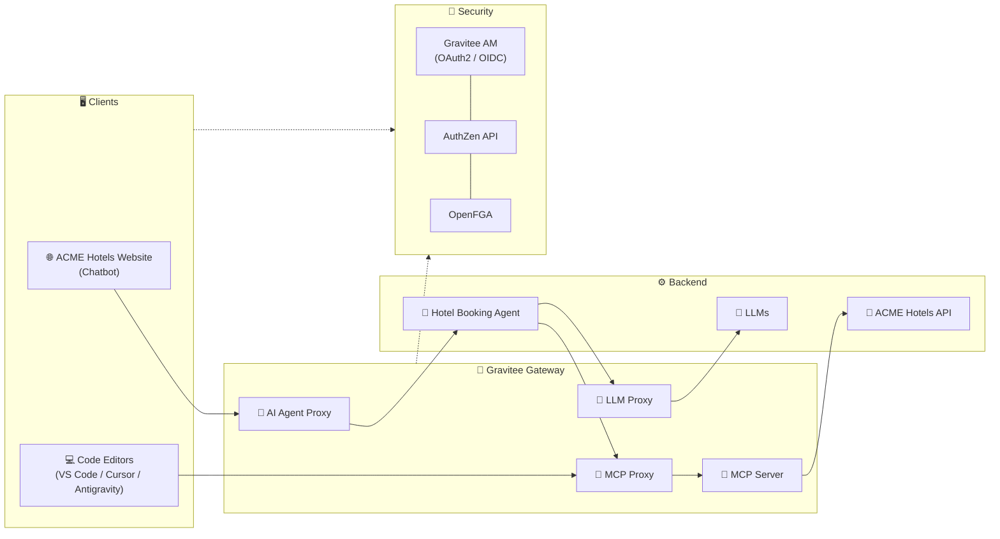
```mermaid
flowchart LR
    subgraph Clients["🖥️ Clients"]
        direction TB
        Website["🌐 ACME Hotels Website<br/>(Chatbot)"]
        Editors["💻 Code Editors<br/>(VS Code / Cursor / Antigravity)"]
    end

    subgraph Gateway["🚀 Gravitee Gateway"]
        direction TB
        AgentProxy["🤖 AI Agent Proxy"]
        MCPProxy["🔌 MCP Proxy"]
        MCPServer["🔧 MCP Server"]
        LLMProxy["🧠 LLM Proxy"]
    end

    subgraph Backend["⚙️ Backend"]
        direction TB
        Agent["🧠 Hotel Booking Agent"]
        API["🏨 ACME Hotels API"]
        LLM["🤖 LLMs"]
    end

    subgraph Security["🔐 Security"]
        direction TB
        IAM["Gravitee AM<br/>(OAuth2 / OIDC)"]
        AuthZen["AuthZen API"]
        OpenFGA["OpenFGA"]
        IAM --- AuthZen
        AuthZen --- OpenFGA
    end

    %% Main flow - Clients to Gateway
    Website --> AgentProxy
    Editors --> MCPProxy

    %% Gateway to Backend
    AgentProxy --> Agent
    MCPProxy --> MCPServer
    MCPServer --> API
    LLMProxy --> LLM

    %% Agent uses Gateway services
    Agent --> MCPProxy
    Agent --> LLMProxy

    %% Auth flows
    Clients -.-> Security
    Gateway -.-> Security
```

The workshop environment is **fully automated**, all APIs, applications, and subscriptions are provisioned automatically when you run `docker compose up -d --build`. This allows you to focus on understanding the concepts rather than manual configuration.

| Component | Purpose |
|-----------|---------|
| **ACME Hotels API** | The underlying REST API for hotel data and bookings |
| **Hotel Booking Agent** | The AI agent that orchestrates tools and LLM to handle user requests |
| **LLMs (Ollama / Gemini)** | Language models providing reasoning and decision-making capabilities |
| **AI Agent Proxy** | Gateway proxy exposing the agent via A2A protocol |
| **MCP Proxy** | Gateway proxy for MCP clients (agents, code editors) to access MCP servers |
| **MCP Server** | Transforms the REST API into AI-discoverable tools |
| **LLM Proxy** | Secure gateway to LLMs with guard rails, token tracking, and rate limiting |
| **Gravitee AM** | OAuth2/OIDC authorization server for authentication |
| **AuthZen** | Standard authorization API integrated in Gravitee AM |
| **OpenFGA** | Fine-grained authorization engine (relationship-based access control) |

---

## 🚀 Setting Up Your Environment

### 1. Unlock Gravitee Enterprise AI Features

The AI features demonstrated in this workshop require a **Gravitee Enterprise License**.

> **🎁 Need a License?** Get your free 2-week license in under a minute by filling out [this form](https://landing.gravitee.io/gravitee-hands-on-ai-workshop)!

**🔑 Configure Your License**

Once you receive your base64-encoded license key by email, configure it using one of these options:

#### Option A: Using .env File (Recommended)

Copy `.env-template` to `.env` and replace `PUT_YOUR_BASE64_LICENSE_HERE` with your license key:

```bash
cp .env-template .env
# Edit .env and paste your license key
```

#### Option B: Export Environment Variable

```bash
export GRAVITEE_LICENSE="YOUR_BASE64_LICENSE_FROM_EMAIL"
```

### 2. Launch the Environment

```bash
docker compose up -d
```

> **💡 Tip:** If you've cloned this repo before and want to rebuild the workshop components to update local images, add `--build` to the command:
> ```bash
> docker compose up -d --build
> ```

*Grab a coffee ☕ - it takes 2-3 minutes for all services to start and the AI model to download.*

### 3. Available Services

| Service | URL | Description |
|---------|-----|-------------|
| **ACME Hotels Website** | http://localhost:8002 | Demo Website - Chat with the AI agent |
| **Gravitee APIM Console** | http://localhost:8084 | API Management Console (login: `admin` / `admin`) |
| **Gravitee APIM Portal** | http://localhost:8085/next | Developer Portal (login: `admin` / `admin`) |
| **Gravitee APIM Gateway** | http://localhost:8082 | API Gateway |
| **Gravitee AM Console** | http://localhost:8081 | Access Management Console (login: `admin` / `adminadmin`) |
| **MCP Inspector** | http://localhost:6274 | Visual MCP Protocol Inspector |

---

## 📖 Understanding the Workshop Components

### **Part 1: Making APIs AI-Agent Ready with MCP 🔧**

#### The Challenge

Traditional REST APIs are designed for developers who read documentation and write code. AI agents, however, need a way to **dynamically discover** what an API can do and **understand** how to use it—without human intervention.

#### The Solution: Model Context Protocol (MCP)

The **Model Context Protocol (MCP)** is an open standard that allows AI agents to discover and interact with external Tools. Think of it as a "universal adapter" that makes any API understandable to an AI agent.

**How it works:**

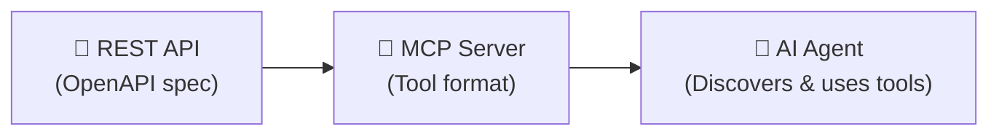
```mermaid
flowchart LR
    A["🔌 REST API<br/>(OpenAPI spec)"] --> B["🔧 MCP Server<br/>(Tool format)"]
    B --> C["🤖 AI Agent<br/>(Discovers & uses tools)"]
```

#### What Gravitee Does

Gravitee's **MCP Entrypoint** automatically transforms your REST API into an MCP server:

1. **Import** your existing OpenAPI specification
2. **Enable** the MCP Entrypoint on your API
3. **Done!** Your API operations become discoverable `Tools`

You can see and configure this in the API **"Internal ACME Hotels API MCP Server"**, section **"Entrypoints"**, tab **"MCP Entrypoint"**, as shown in the screenshot below.

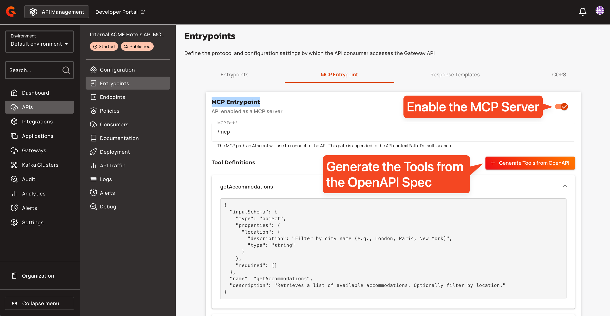

#### 🔍 Explore with the MCP Inspector

Open the **MCP Inspector** at http://localhost:6274 to see how an AI agent perceives your API:

1. Select **"Streamable HTTP"** as the transport
2. Enter the MCP server URL: `http://apim-gateway:8082/hotels/mcp`
3. Click **Connect**

You'll see your hotel booking operations exposed as tools:
- `getAccommodation` - Get details of a specific hotel
- `getBookings` - View bookings (requires authentication)

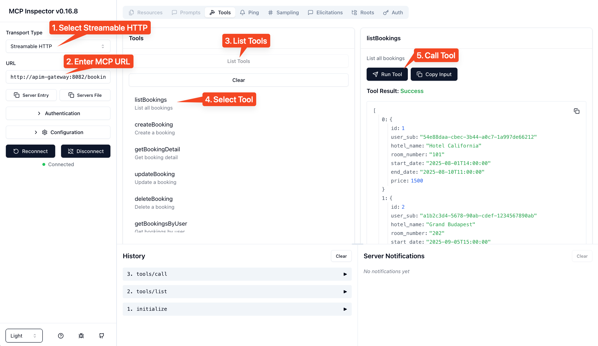

> **💡 Key Insight:** The MCP server doesn't change your API—it provides a **new interface** that AI agents can understand, while the underlying REST API remains unchanged.

---

### **Part 2: Controlling the AI Brain with LLM Proxy 🧠**

#### The Challenge

Large Language Models (LLMs) are the "brain" of AI agents, they enable reasoning and decision-making. However, raw access to LLMs introduces several risks:

- **Cost explosion** — No visibility into token usage
- **Security risks** — Users might try to extract sensitive data or inject harmful prompts
- **Lack of governance** — No way to enforce policies or audit usage

#### The Solution: LLM Proxy

Gravitee's **LLM Proxy** acts as a secure gateway to your language models, providing:

| Capability | Description |
|------------|-------------|
| **Unified Access** | Single entry point for multiple LLM providers (OpenAI compatible, Gemini, Bedrock, Ollama, etc.) |
| **LLMs Routing** | Route requests to specific models and providers based on plans, subscriptions, or custom conditions |
| **Token Tracking** | Monitor usage for cost analysis and chargeback |
| **Guard Rails** | Block PII, Payment information, toxic, and any kind of inappropriate prompts before they reach the LLM |
| **Token based Rate Limiting and Quota** | Control consumption with token-based limits |
| **Observability** | Full visibility into AI interactions |

#### LLMs Routing

With LLMs Routing, you can control which models and providers are accessible based on:

- **API Plans** — Free tier users get access to lightweight models (e.g., qwen3:0.6b), while premium users can access advanced models (e.g., Opus 4.5, Gemini 3 Pro)
- **Subscriptions** — Different applications or teams can be entitled to different model sets
- **Custom Conditions** — Route based on user roles, request content, geography, or any business logic

This enables fine-grained control over your AI infrastructure: restrict expensive models to authorized users, ensure compliance by routing to approved providers, and optimize costs by directing requests to the most appropriate model.

#### Architecture

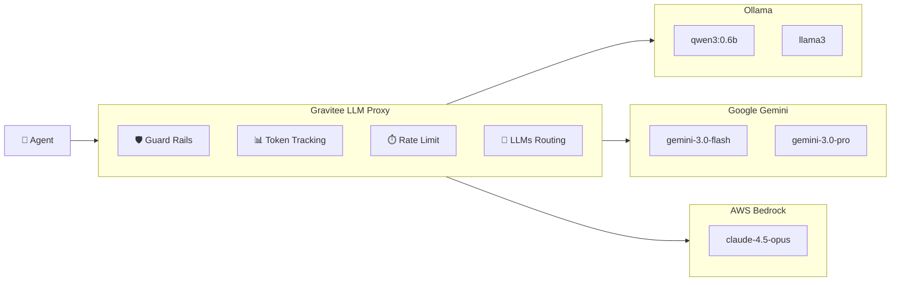
```mermaid
flowchart LR
    A["🤖 Agent"] --> B
    subgraph B["Gravitee LLM Proxy"]
        direction TB
        B1["🛡️ Guard Rails"]
        B2["📊 Token Tracking"]
        B3["⏱️ Rate Limit"]
        B4["🔀 LLMs Routing"]
    end
    B --> C1
    B --> C2
    B --> C3
    subgraph C1["Ollama"]
        C1a["qwen3:0.6b"]
        C1b["llama3"]
    end
    subgraph C2["Google Gemini"]
        C2a["gemini-3.0-flash"]
        C2b["gemini-3.0-pro"]
    end
    subgraph C3["AWS Bedrock"]
        C3a["claude-4.5-opus"]
    end
```

#### 🧪 Test the LLM Rate Limits and Guard Rails

You can explore the **"ACME Hotels LLMs"** API in the Gravitee APIM Console to see how policies are applied. Navigate to the API's **Policies** section to observe:
- **Guard Rails** policy protecting against toxic, PII, and inappropriate prompts
- **Token Rate Limit** policy controlling token consumption per application

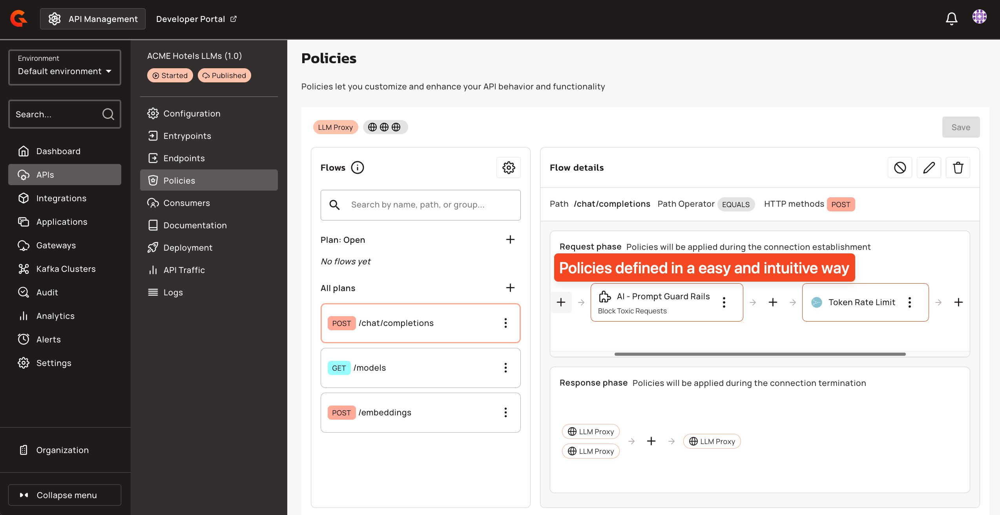

The screenshot below shows a chatbot conversation demonstrating the Guard Rails and Rate Limit in action. When a user sends a toxic request, the Guard Rails policy detects it and blocks the request before it reaches the LLM.

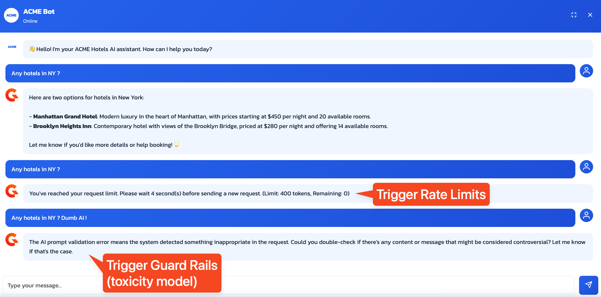

> **💡 Key Insight:** The LLM Proxy protects your AI infrastructure without modifying your agent code. Policies are applied at the gateway level.

---

### **Part 3: The AI Agent Architecture 🤖**

Now that we have:
- ✅ **Data access** via MCP Server (tools the agent can use)
- ✅ **Reasoning capability** via LLM Proxy (the agent's brain)

We can build the **AI Agent** itself—the orchestrator that brings everything together.

#### Agent Structure

The ACME Hotels booking agent consists of three main components:

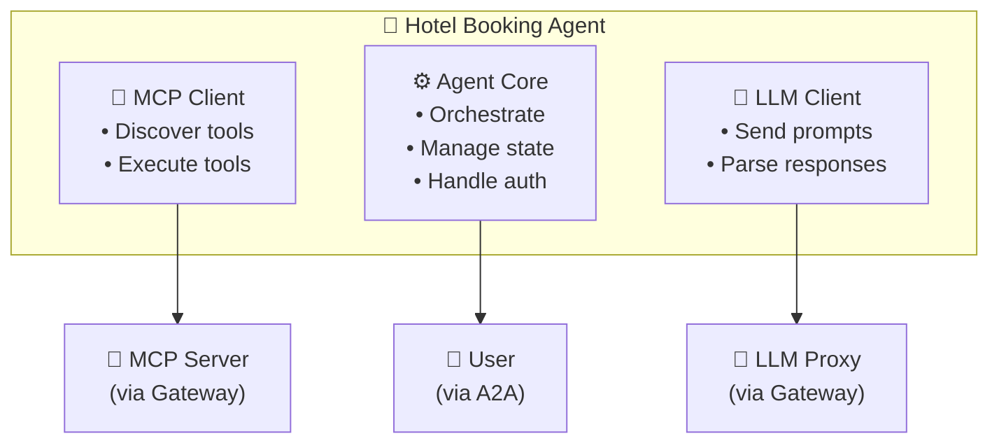
```mermaid
flowchart TB
    subgraph Agent["🏨 Hotel Booking Agent"]
        direction LR
        MCP["🔌 MCP Client<br/>• Discover tools<br/>• Execute tools"]
        Core["⚙️ Agent Core<br/>• Orchestrate<br/>• Manage state<br/>• Handle auth"]
        LLM["🧠 LLM Client<br/>• Send prompts<br/>• Parse responses"]
    end
    
    MCP --> MCPServer["🔧 MCP Server<br/>(via Gateway)"]
    LLM --> LLMProxy["🤖 LLM Proxy<br/>(via Gateway)"]
    Core --> User["👤 User<br/>(via A2A)"]
```

#### The Agent Loop: Discover → Decide → Execute → Reflect

Every AI agent follows a fundamental reasoning loop:

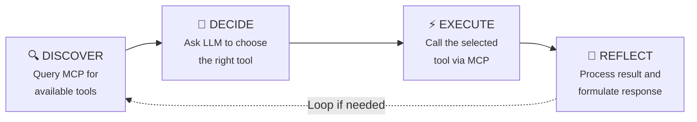
```mermaid
flowchart LR
    A["🔍 DISCOVER<br/><small>Query MCP for<br/>available tools</small>"] --> B["🤔 DECIDE<br/><small>Ask LLM to choose<br/>the right tool</small>"]
    B --> C["⚡ EXECUTE<br/><small>Call the selected<br/>tool via MCP</small>"]
    C --> D["💭 REFLECT<br/><small>Process result and<br/>formulate response</small>"]
    D -.->|"Loop if needed"| A
```

| Phase | What Happens | Component Used |
|-------|--------------|----------------|
| **1. Discover** | Agent queries MCP server for available tools | MCP Client |
| **2. Decide** | Agent sends user query + tools to LLM, which decides what to do | LLM Client |
| **3. Execute** | Agent calls the selected tool with parameters from LLM | MCP Client |
| **4. Reflect** | Agent sends tool result to LLM to generate final response | LLM Client |

#### Example Flow

When a user asks *"Show me hotels in Paris"*:

1. **Discover:** Agent fetches tools from MCP → finds `listAccommodations`
2. **Decide:** LLM receives query + tools → decides to call `listAccommodations(city="Paris")`
3. **Execute:** Agent calls the tool → receives hotel data
4. **Reflect:** LLM formats the data into a friendly response

#### Why Expose the Agent Through the Gateway?

The agent itself is exposed through the Gravitee Gateway as an **A2A (Agent-to-Agent) Proxy**. This provides:

- **Security:** Authentication and authorization at the gateway level
- **Observability:** Full logging and monitoring of agent interactions
- **Control:** Apply policies, rate limits, and quotas to agent access

---

### **Part 4: Authentication & Fine-Grained Authorization 🔐**

#### The Challenge

AI agents often need to access user-specific data. In our hotel booking scenario:
- *"Show me hotels in Paris"* → Public data, no authentication needed
- *"Show me my bookings"* → Private data, requires knowing who "me" is

Beyond authentication (who are you?), we need **authorization** (what can you do?):
- Can this user view bookings?
- Can this user create bookings?
- Can this user view *other users'* bookings?

#### The Solution: Gravitee AM + OpenFGA

The workshop uses two complementary systems in Gravitee Access Management :

| System | Purpose |
|--------|---------|
| **OAuth2.1 Authorization Server** | Handle authentication (OAuth2/OIDC) and identity |
| **Fine-Grained Authorization Engine** | Handle fine-grained authorization (relationship-based access control) through OpenFGA and the AuthZen Authorization API integrated in Gravitee AM |

#### Authentication Flow

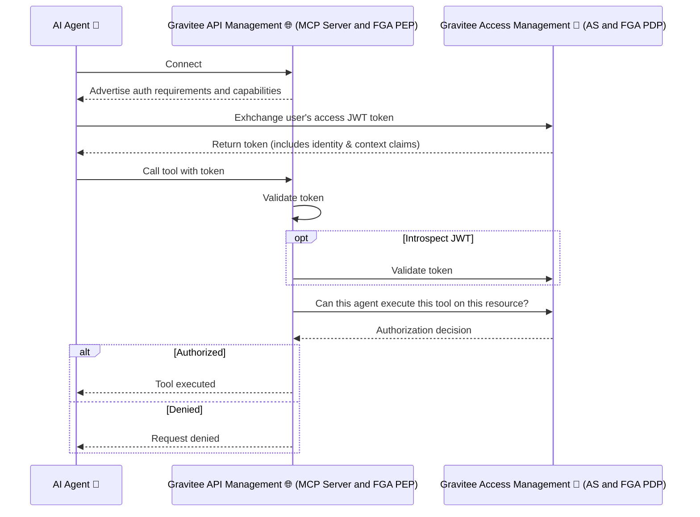
```mermaid
sequenceDiagram
    participant Agent as AI Agent 🤖
    participant MCP as Gravitee API Management 🌐 (MCP Server and FGA PEP)
    participant Auth as Gravitee Access Management 🔐 (AS and FGA PDP)

    Agent->>MCP: Connect
    MCP-->>Agent: Advertise auth requirements and capabilities

    Agent->>Auth: Exhchange user's access JWT token
    Auth-->>Agent: Return token (includes identity & context claims)

    Agent->>MCP: Call tool with token
    MCP->>MCP: Validate token

    opt Introspect JWT
    MCP->>Auth: Validate token
    end

    MCP->>Auth: Can this agent execute this tool on this resource?
    Auth-->>MCP: Authorization decision

    alt Authorized
        MCP-->>Agent: Tool executed
    else Denied
        MCP-->>Agent: Request denied
    end
```

#### Fine-Grained Authorization with OpenFGA

OpenFGA uses a **relationship-based model** to define who can do what:

```
# Example authorization model
user:john can view booking:123
user:admin can view all bookings
```

You can explore the **Fine-Grained Authorization** configuration in the [Gravitee AM Console](http://localhost:8081). The screenshot below shows the **OpenFGA Authorization Model**, which defines the relationships structure between entities (users, resources, permissions).

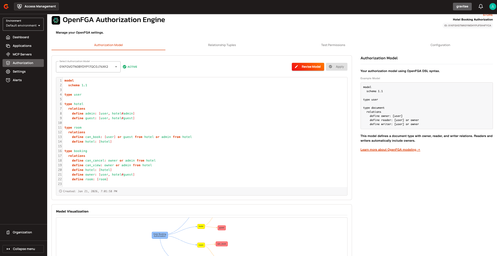

The following screenshot shows the **Authorization Tuples**, which represent the actual authorization data following the model—defining who can do what. For example, `user:john` can `view` `booking:123`.

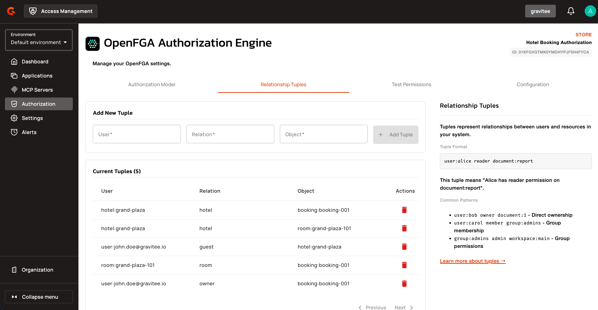

#### Try It Out

1. **Without authentication:** Ask *"Show me hotels in Paris"* → Works! (public data)
2. **Without authentication:** Ask *"Show me my bookings"* → Fails! (needs identity)
3. **With authentication:** Log in as `john.doe@gravitee.io` / `HelloWorld@123`
4. **After authentication:** Ask *"Show me my bookings"* → Works! (identity and permissions verified)

> **💡 Key Insight:** The agent doesn't hardcode authorization logic. It relies on Gravitee AM for identity and permissions, making the security model flexible and auditable.

---

## 🏁 Wrapping Up

When you're done exploring:

```bash
docker compose down
```

---

## 🎓 Key Takeaways

| Concept | What You Learned |
|---------|------------------|
| **MCP Servers** | Transform any REST API into AI-discoverable tools without changing the underlying API |
| **LLM Proxy** | Secure, monitor, and control access to language models through a unified gateway |
| **Agent Architecture** | Agents follow a Discover → Decide → Execute → Reflect loop |
| **Authorization** | Combine OAuth2/OIDC for identity with OpenFGA for fine-grained permissions |

---

## Proxying an MCP server

### Pre-requisite

- define the GRAVITEE_LICENSE environment variable with a base64 encoded valid license.

### Create a keyless MCP API

Follow these steps to create a keyless MCP API:  
APIs > + Add API > Create V4 API  
Give it the name and the version you want.  
AI Gateway > MCP Proxy  
Context-path : you can give it the text you want, but for our example we will give it the value `/mcp-kl`.  
MCP Server Backend URL : http://mcp-server:8000/mcp. You can leave the rest as it is.

You can now try to call this MCP API from your VS Code tool.

### Create an OAuth2 protected MCP API

#### On the AM interface

Go to the AM interface (http://localhost:8081).  
Login with the following credentials: `admin` / `adminadmin`.  
MCP Servers > +  
Name: APIM MCP Server  
MCP Resource Identifier: http://localhost:8082/mcp-am  
Client ID: apim-mcp-server-client-id  
Client Secret: apim-mcp-server-client-secret

Enable the auto registration by doing the following:  
Settings > Client Registration  
Enable the following:
- Dynamic Client Registration
- Open Dynamic Client Registration
- Dynamic Client Registration Templates

#### On the APIM interface

Go back to the APIM interface (http://localhost:8084).

Follow these steps to create an OAuth2 protected MCP API:  
APIs > + Add API > Create V4 API  
Give it the name and the version you want.  
AI Gateway > MCP Proxy  
Context-path : you can give it the text you want, but for our example we will give it the value `/mcp-am`.  
MCP Server Backend URL : http://mcp-server:8000/mcp. You can leave the rest as it is.

> Given that we're in full docker mode, you need to add this line to your `/etc/hosts` file:  
> `127.0.0.1       am-gateway`

Configuration > Resources > + Add resource > Gravitee.io AM Authorization Server  
Name: AM Auth Server  
Server URL: http://am-gateway:8092  
Security domain: gravitee  
Client ID: apim-mcp-server-client-id  
Client Secret: apim-mcp-server-client-secret

Go to the Consumers part.  
Close the Default Keyless plan.  
\+ Add new plan > OAuth2  
Name: OAuth2 - AM  
Click Next
Select your previously created OAuth2 resource.
Click next and create it.
Publish the plan and deploy your API.

Now if you try to connect to your MCP API from VS Code, you should be asked to pass multiple authentication validation steps before being able to use your MCP API.  
When asked to login, use the following credentials:  
`john.doe@gravitee.io`  
`HelloWorld@123`

You can then for example ask the current bookings:

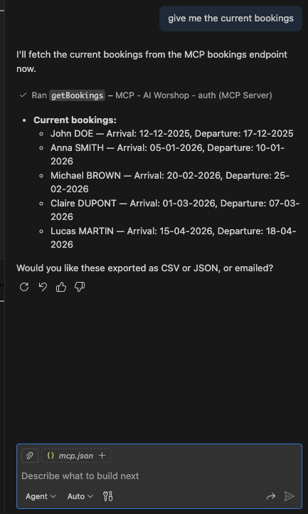

### Add MCP policies

Without MCP policies, the user will have access to all the tools, resources, and prompts available.
You can restrict these accesses with MCP policies.

To create an MCP policy related to your API, follow these steps:  
APIs > your API > Policies  
Click on the + icon next to your OAuth2 plan.  
Give a name to your flow.  
If you want to apply your flow only to a specific type of MCP methods, choose the one you want to select.
Otherwise the flow will be applied to all MCP methods. For our example we choose to apply it to all the MCP methods.  
You can also add a condition to execute the flow, which supports Expression Language.

Once your flow created, click on the + icon in the Request phase.  
Type MCP in the search bar and select the MCP ACL policy.  
You can add a description, a trigger condition (which supports also Expression Language), and your ACLs.  
Let's start by creating a policy with all the fields like this, without any value.

Save and deploy your API.

Now if you try to reconnect to your MCP server through your MCP API, you should have access to 0 tool and 0 resource anymore.
This is because an MCP ACL policy works as a whitelist, so you must explicitly specify the tools or resources you allow the user to access.

To do this we can edit our current policy:  
Click on the policy in the Request phase > Edit > ACLs > + Add  
Features:
- Select option: Tools
- Tool methods: tools/list
- Name Pattern Type: LITERAL
- Name Pattern: get_bookings

Save and deploy your API.

Now if you try to reconnect to your MCP server through your MCP API, you should have access to 1 tool: get_bookings.

---

## 🔧 Troubleshooting

### Request Timeout (30 seconds) on macOS

**Problem:** Requests to the AI agent timeout after ~30 seconds.

**Cause:** Docker Desktop on macOS has a hardcoded network proxy timeout. The LLM running in CPU-only mode can exceed this limit.

**💡 Recommended Solution:** Run Ollama locally on your Mac:

1. **Install Ollama:**
   ```bash
   brew install ollama
   ```

2. **Start Ollama and pull the model:**
   ```bash
   ollama serve
   ollama pull qwen3:0.6b
   ```

3. **Update the API `ACME Hotels LLMs` endpoint URL configuration** in Gravitee Console to point to `http://host.docker.internal:11434/v1` instead of `http://ollama:11434/v1`

**Benefits:**
- ⚡ Much faster responses (GPU acceleration)
- 🚫 No timeout issues

**Alternative:** Use [Colima](https://github.com/abiosoft/colima) instead of Docker Desktop.

---

## 📚 Learn More

- [Model Context Protocol (MCP) Specification](https://modelcontextprotocol.io/)
- [A2A Protocol Documentation](https://google.github.io/A2A/)
- [OpenFGA Documentation](https://openfga.dev/)
- [Gravitee AI Agent Mesh](https://www.gravitee.io/)

---

**Happy learning! 🚀**
