# Gravitee AI Agent Workshop: ACME Hotels 🏨🤖

Welcome to the **Gravitee AI Agent Workshop**! This hands-on workshop demonstrates how to build, secure, and manage AI agents using the **Gravitee AI Agent Mesh**. Through the lens of a fictional hotel booking company—**ACME Hotels**—you'll explore the key concepts and technologies powering the next generation of AI-driven applications.

## ⚡ TL;DR - Quick Start (5 Minutes)

Want to dive straight in? Follow these simple steps:

1. **Get Your License** 🔑  
   Make sure you have a Gravitee Enterprise license file. If not, check the section ["Unlock Gravitee Enterprise AI Features"](#1-unlock-gravitee-enterprise-ai-features) below to get your free 2-week license in less than a minute.

2. **Install Ollama** 🧠  
    *(Why Ollama? It’s the LLM runtime that lets the agent “think” and decide which tools to call.)*  
    > *Recommended for everyone: local Ollama is consistently faster and more responsive than running it in a container.*
   
    Download and install Ollama from https://ollama.com/download
    ```bash
    ollama serve
    ollama pull qwen3:0.6b # Small 500MB Model, capable enough to handle Agentic workflows
    ollama list | grep -q 'qwen3:0.6b' && echo "Ollama OK"
    ```

3. **Start the Workshop** 🚀  
    ```bash
    docker compose up -d --build
    ```
    *(This can take a few minutes to download and start all images - grab a coffee! ☕)*

4. **Visit the Hotel Website** 🏨 
   Open your browser and go to the **[ACME Hotels Demo Website](http://localhost:8002/)**

5. **Start Chatting with the AI Agent** 💬  
   Try these interactions to see the platform in action:
   
   - **✅ "Do you have any hotels in New York?"**  
     *This will work perfectly - it's a valid public request*
   
   - **🚫 "Do you have any hotels in New York? Dumb AI !"**  
     *This will be blocked by Gravitee AI Guard Rails because it contains toxic language*
   
   - **🔒 "Show me my bookings"**  
     *This will fail because you need to be authenticated to access private data. Log in with:*
     - **Email:** `john.doe@gravitee.io`
     - **Password:** `HelloWorld@123`
     
     *Now retry the request - you can now access your personal bookings!*

**💡 Want to understand how this all works?** Continue reading to explore the architecture, understand each component, and learn how enterprise AI agents are built and secured! 👇

---

## 🎯 What You'll Learn

This workshop will help you understand the core concepts behind AI agents and the Gravitee AI Agent Mesh:

| Concept | Description |
|---------|-------------|
| **MCP Servers** | How to transform REST APIs into AI-discoverable Tools |
| **LLM Proxy** | How to control and secure access to Large Language Models |
| **AI Agents** | How agents reason, decide, and execute actions |
| **Authentication & Authorization** | How to implement fine-grained access control with OpenFGA and AuthZen |

---

## 🏗️ Architecture Overview


The workshop environment is **fully automated**, all APIs, applications, and subscriptions are provisioned automatically when you run `docker compose up -d --build`. This allows you to focus on understanding the concepts rather than manual configuration.

| Component | Purpose |
|-----------|---------|
| **ACME Hotels API** | The underlying REST API for hotel data and bookings |
| **Hotel Booking Agent** | The AI agent that orchestrates tools and LLM to handle user requests |
| **LLMs (Ollama / Gemini)** | Language models providing reasoning and decision-making capabilities |
| **AI Agent Proxy** | Gateway proxy exposing the agent via A2A protocol |
| **MCP Proxy** | Gateway proxy for MCP clients (agents, code editors) to access MCP servers |
| **MCP Server** | Transforms the REST API into AI-discoverable tools |
| **LLM Proxy** | Secure gateway to LLMs with guard rails, token tracking, and rate limiting |
| **Gravitee AM** | OAuth2/OIDC authorization server for authentication |
| **AuthZen** | Standard authorization API integrated in Gravitee AM |
| **OpenFGA** | Fine-grained authorization engine (relationship-based access control) |

---

## 🚀 Setting Up Your Environment

### 1. Unlock Gravitee Enterprise AI Features

The AI features demonstrated in this workshop require a **Gravitee Enterprise License**.

> **🎁 Need a License?** Get your free 2-week license in under a minute by filling out [this form](https://landing.gravitee.io/gravitee-hands-on-ai-workshop)!

**🔑 Configure Your License**

Once you receive your base64-encoded license key by email, configure it using one of these options:

#### Option A: Using .env File (Recommended)

Copy `.env-template` to `.env` and replace `PUT_YOUR_BASE64_LICENSE_HERE` with your license key:

```bash
cp .env-template .env
# Edit .env and paste your license key
```

#### Option B: Export Environment Variable

```bash
export GRAVITEE_LICENSE="YOUR_BASE64_LICENSE_FROM_EMAIL"
```

### 2. Install and Validate Ollama Locally (Recommended)

Download and install Ollama from https://ollama.com/download

```bash
ollama serve
ollama pull qwen3:0.6b
ollama list | grep -q 'qwen3:0.6b' && echo "Ollama OK"
```

> **Optional (CPU-only alternative):** You can use the Dockerized Ollama service by uncommenting it in the Docker Compose file, but it will be slower than running Ollama locally.

### 3. Launch the Environment

```bash
docker compose up -d
```

> **💡 Tip:** If you've cloned this repo before and want to rebuild the workshop components to update local images, add `--build` to the command:
> ```bash
> docker compose up -d --build
> ```

*Grab a coffee ☕ - it takes 2-3 minutes for all services to start and the AI model to download.*

### 3. Available Services

| Service | URL | Description |
|---------|-----|-------------|
| **ACME Hotels Website** | http://localhost:8002 | Demo Website - Chat with the AI agent |
| **Gravitee APIM Console** | http://localhost:8084 | API Management Console (login: `admin` / `admin`) |
| **Gravitee APIM Portal** | http://localhost:8085/next | Developer Portal (login: `admin` / `admin`) |
| **Gravitee APIM Gateway** | http://localhost:8082 | API Gateway |
| **Gravitee AM Console** | http://localhost:8081 | Access Management Console (login: `admin` / `adminadmin`) |
| **MCP Inspector** | http://localhost:6274 | Visual MCP Protocol Inspector |

---

## 📖 Understanding the Workshop Components

### **Part 1: Making APIs AI-Agent Ready with MCP 🔧**

#### The Challenge

Traditional REST APIs are designed for developers who read documentation and write code. AI agents, however, need a way to **dynamically discover** what an API can do and **understand** how to use it—without human intervention.

#### The Solution: Model Context Protocol (MCP)

The **Model Context Protocol (MCP)** is an open standard that allows AI agents to discover and interact with external Tools. Think of it as a "universal adapter" that makes any API understandable to an AI agent.

**How it works:**

```mermaid
flowchart LR
    A["🔌 REST API<br/>(OpenAPI spec)"] --> B["🔧 MCP Server<br/>(Tool format)"]
    B --> C["🤖 AI Agent<br/>(Discovers & uses tools)"]
```



#### What Gravitee Does

Gravitee's **MCP Entrypoint** automatically transforms your REST API into an MCP server:

1. **Import** your existing OpenAPI specification
2. **Enable** the MCP Entrypoint on your API
3. **Done!** Your API operations become discoverable `Tools`

You can see and configure this in the API **"Internal ACME Hotels API MCP Server"**, section **"Entrypoints"**, tab **"MCP Entrypoint"**, as shown in the screenshot below.


#### 🔍 Explore with the MCP Inspector

Open the **MCP Inspector** at http://localhost:6274 to see how an AI agent perceives your API:

1. Select **"Streamable HTTP"** as the transport
2. Enter the MCP server URL: `http://apim-gateway:8082/hotels/mcp`
3. Click **Connect**

You'll see your hotel booking operations exposed as tools:
- `getAccommodation` - Get details of a specific hotel
- `getBookings` - View bookings (requires authentication)


> **💡 Key Insight:** The MCP server doesn't change your API—it provides a **new interface** that AI agents can understand, while the underlying REST API remains unchanged.

---

### **Part 2: Controlling the AI Brain with LLM Proxy 🧠**

#### The Challenge

Large Language Models (LLMs) are the "brain" of AI agents, they enable reasoning and decision-making. However, raw access to LLMs introduces several risks:

- **Cost explosion** — No visibility into token usage
- **Security risks** — Users might try to extract sensitive data or inject harmful prompts
- **Lack of governance** — No way to enforce policies or audit usage

#### The Solution: LLM Proxy

Gravitee's **LLM Proxy** acts as a secure gateway to your language models, providing:

| Capability | Description |
|------------|-------------|
| **Unified Access** | Single entry point for multiple LLM providers (OpenAI compatible, Gemini, Bedrock, Ollama, etc.) |
| **LLMs Routing** | Route requests to specific models and providers based on plans, subscriptions, or custom conditions |
| **Token Tracking** | Monitor usage for cost analysis and chargeback |
| **Guard Rails** | Block PII, Payment information, toxic, and any kind of inappropriate prompts before they reach the LLM |
| **Token based Rate Limiting and Quota** | Control consumption with token-based limits |
| **Observability** | Full visibility into AI interactions |

#### LLMs Routing

With LLMs Routing, you can control which models and providers are accessible based on:

- **API Plans** — Free tier users get access to lightweight models (e.g., qwen3:0.6b), while premium users can access advanced models (e.g., Opus 4.5, Gemini 3 Pro)
- **Subscriptions** — Different applications or teams can be entitled to different model sets
- **Custom Conditions** — Route based on user roles, request content, geography, or any business logic

This enables fine-grained control over your AI infrastructure: restrict expensive models to authorized users, ensure compliance by routing to approved providers, and optimize costs by directing requests to the most appropriate model.

#### Architecture

```mermaid
flowchart LR
    A["🤖 Agent"] --> B
    subgraph B["Gravitee LLM Proxy"]
        direction TB
        B1["🛡️ Guard Rails"]
        B2["📊 Token Tracking"]
        B3["⏱️ Rate Limit"]
        B4["🔀 LLMs Routing"]
    end
    B --> C1
    B --> C2
    B --> C3
    subgraph C1["Ollama"]
        C1a["qwen3:0.6b"]
        C1b["llama3"]
    end
    subgraph C2["Google Gemini"]
        C2a["gemini-3.0-flash"]
        C2b["gemini-3.0-pro"]
    end
    subgraph C3["AWS Bedrock"]
        C3a["claude-4.5-opus"]
    end
```



#### 🧪 Test the LLM Rate Limits and Guard Rails

You can explore the **"ACME Hotels LLMs"** API in the Gravitee APIM Console to see how policies are applied. Navigate to the API's **Policies** section to observe:
- **Guard Rails** policy protecting against toxic, PII, and inappropriate prompts
- **Token Rate Limit** policy controlling token consumption per application


The screenshot below shows a chatbot conversation demonstrating the Guard Rails and Rate Limit in action. When a user sends a toxic request, the Guard Rails policy detects it and blocks the request before it reaches the LLM.


> **💡 Key Insight:** The LLM Proxy protects your AI infrastructure without modifying your agent code. Policies are applied at the gateway level.

---

### **Part 3: The AI Agent Architecture 🤖**

Now that we have:
- ✅ **Data access** via MCP Server (tools the agent can use)
- ✅ **Reasoning capability** via LLM Proxy (the agent's brain)

We can build the **AI Agent** itself—the orchestrator that brings everything together.

#### Agent Structure

The ACME Hotels booking agent consists of three main components:

```mermaid
flowchart TB
    subgraph Agent["🏨 Hotel Booking Agent"]
        direction LR
        MCP["🔌 MCP Client<br/>• Discover tools<br/>• Execute tools"]
        Core["⚙️ Agent Core<br/>• Orchestrate<br/>• Manage state<br/>• Handle auth"]
        LLM["🧠 LLM Client<br/>• Send prompts<br/>• Parse responses"]
    end
    
    MCP --> MCPServer["🔧 MCP Server<br/>(via Gateway)"]
    LLM --> LLMProxy["🤖 LLM Proxy<br/>(via Gateway)"]
    Core --> User["👤 User<br/>(via A2A)"]
```



#### The Agent Loop: Discover → Decide → Execute → Reflect

Every AI agent follows a fundamental reasoning loop:

```mermaid
flowchart LR
    A["🔍 DISCOVER<br/><small>Query MCP for<br/>available tools</small>"] --> B["🤔 DECIDE<br/><small>Ask LLM to choose<br/>the right tool</small>"]
    B --> C["⚡ EXECUTE<br/><small>Call the selected<br/>tool via MCP</small>"]
    C --> D["💭 REFLECT<br/><small>Process result and<br/>formulate response</small>"]
    D -.->|"Loop if needed"| A
```



| Phase | What Happens | Component Used |
|-------|--------------|----------------|
| **1. Discover** | Agent queries MCP server for available tools | MCP Client |
| **2. Decide** | Agent sends user query + tools to LLM, which decides what to do | LLM Client |
| **3. Execute** | Agent calls the selected tool with parameters from LLM | MCP Client |
| **4. Reflect** | Agent sends tool result to LLM to generate final response | LLM Client |

#### Example Flow

When a user asks *"Show me hotels in Paris"*:

1. **Discover:** Agent fetches tools from MCP → finds `listAccommodations`
2. **Decide:** LLM receives query + tools → decides to call `listAccommodations(city="Paris")`
3. **Execute:** Agent calls the tool → receives hotel data
4. **Reflect:** LLM formats the data into a friendly response

#### Why Expose the Agent Through the Gateway?

The agent itself is exposed through the Gravitee Gateway as an **A2A (Agent-to-Agent) Proxy**. This provides:

- **Security:** Authentication and authorization at the gateway level
- **Observability:** Full logging and monitoring of agent interactions
- **Control:** Apply policies, rate limits, and quotas to agent access

---

### **Part 4: Authentication & Fine-Grained Authorization 🔐**

#### The Challenge

AI agents often need to access user-specific data. In our hotel booking scenario:
- *"Show me hotels in Paris"* → Public data, no authentication needed
- *"Show me my bookings"* → Private data, requires knowing who "me" is

Beyond authentication (who are you?), we need **authorization** (what can you do?):
- Can this user view bookings?
- Can this user create bookings?
- Can this user view *other users'* bookings?

#### The Solution: Gravitee AM + OpenFGA

The workshop uses two complementary systems in Gravitee Access Management :

| System | Purpose |
|--------|---------|
| **OAuth2.1 Authorization Server** | Handle authentication (OAuth2/OIDC) and identity |
| **Fine-Grained Authorization Engine** | Handle fine-grained authorization (relationship-based access control) through OpenFGA and the AuthZen Authorization API integrated in Gravitee AM |

#### Authentication Flow

```mermaid
sequenceDiagram
    participant Agent as AI Agent 🤖
    participant MCP as Gravitee API Management 🌐 (MCP Server and FGA PEP)
    participant Auth as Gravitee Access Management 🔐 (AS and FGA PDP)

    Agent->>MCP: Connect
    MCP-->>Agent: Advertise auth requirements and capabilities

    Agent->>Auth: Exhchange user's access JWT token
    Auth-->>Agent: Return token (includes identity & context claims)

    Agent->>MCP: Call tool with token
    MCP->>MCP: Validate token

    opt Introspect JWT
    MCP->>Auth: Validate token
    end

    MCP->>Auth: Can this agent execute this tool on this resource?
    Auth-->>MCP: Authorization decision

    alt Authorized
        MCP-->>Agent: Tool executed
    else Denied
        MCP-->>Agent: Request denied
    end
```



#### Fine-Grained Authorization with OpenFGA

OpenFGA uses a **relationship-based model** to define who can do what:

```
# Example authorization model
user:john can view booking:123
user:admin can view all bookings
```

You can explore the **Fine-Grained Authorization** configuration in the [Gravitee AM Console](http://localhost:8081). The screenshot below shows the **OpenFGA Authorization Model**, which defines the relationships structure between entities (users, resources, permissions).


The following screenshot shows the **Authorization Tuples**, which represent the actual authorization data following the model—defining who can do what. For example, `user:john` can `view` `booking:123`.


#### Try It Out

1. **Without authentication:** Ask *"Show me hotels in Paris"* → Works! (public data)
2. **Without authentication:** Ask *"Show me my bookings"* → Fails! (needs identity)
3. **With authentication:** Log in as `john.doe@gravitee.io` / `HelloWorld@123`
4. **After authentication:** Ask *"Show me my bookings"* → Works! (identity and permissions verified)

> **💡 Key Insight:** The agent doesn't hardcode authorization logic. It relies on Gravitee AM for identity and permissions, making the security model flexible and auditable.

---

## 🏁 Wrapping Up

When you're done exploring:

```bash
docker compose down
```

---

## 🎓 Key Takeaways

| Concept | What You Learned |
|---------|------------------|
| **MCP Servers** | Transform any REST API into AI-discoverable tools without changing the underlying API |
| **LLM Proxy** | Secure, monitor, and control access to language models through a unified gateway |
| **Agent Architecture** | Agents follow a Discover → Decide → Execute → Reflect loop |
| **Authorization** | Combine OAuth2/OIDC for identity with OpenFGA for fine-grained permissions |

---

## 🔧 Troubleshooting

### Slow or Timing Out AI Responses

**Problem:** AI requests are slow or time out (~30 seconds).

**Cause:** LLM inference is running in a CPU-only container.

**💡 Recommended Solution:** Run Ollama locally for better performance:

1. **Install Ollama:** https://ollama.com/download

2. **Start Ollama and pull the model:**
    ```bash
    ollama serve
    ollama pull qwen3:0.6b
    ```

3. **Validate the model is available:**
     ```bash
     ollama list | grep -q 'qwen3:0.6b' && echo "Ollama OK"
     ```

4. **Update the API `ACME Hotels LLMs` endpoint URL configuration** in Gravitee Console to point to `http://host.docker.internal:11434` instead of `http://ollama:11434`

**Benefits:**
- ⚡ Faster responses
- ✅ Fewer timeouts

**Alternative:** If you keep Ollama in Docker, expect slower responses due to CPU-only inference.

---
## 📚 Learn More

- [Model Context Protocol (MCP) Specification](https://modelcontextprotocol.io/)
- [A2A Protocol Documentation](https://google.github.io/A2A/)
- [OpenFGA Documentation](https://openfga.dev/)
- [Gravitee AI Agent Mesh](https://www.gravitee.io/)

---

**Happy learning! 🚀**
